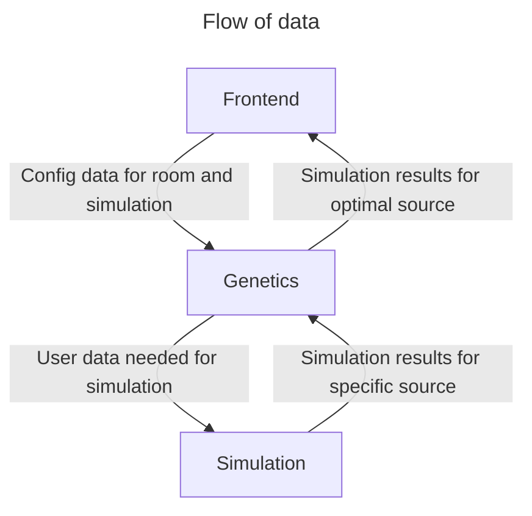

# Communication Standards



## Frontend -> Genetics -> Simulation

In our simulation set normal vector for speaker where sound comes out

The data that needs to be sent to the simulation is as follows:

<!-- the direction of the speaker's normal isn't needed as this is found by the optimisation algorithm -->

- the GLB file in it's entirety
- 1 `float` which is the size of a voxel (render/heatmap resolution)
- the material for the floor, walls, and roof
  - *(later)* this will be three different materials for now only one
- fps (bin width is always 1 frame)
- num rays
<!-- - intensity threshold for a ray (use 0dB as that is the lowest audible -->
- source information <!-- possibly -->
  - num sources
  - source location
  - normal for each source

```json
{
  "glb_path": "<path_to_glb>",
  "voxel_size": "<size_of_voxel {float}>",
  "materials": {
    "floor": "<floor_material>",
    "walls": "<wall_material>",
    "roof": "<roof_material>",
  },
  "fps": "<fps {uint8}>",
  "num_rays": "<num_rays {uint32}",
  "source_information": {
    "num_sources": "<num_sources {uint8}",
    "sources": [
      {
        "loc": ["<loc_x {uint32}>", "<loc_y {uint32}>", "<loc_z {uint32}>"],
        "normal": ["<normal_x {uint32}>", "<normal_y {uint32}>", "<normal_z {uint32}>"]
      }
    ]
  }
}
```

## Frontend -> Genetics

- X, Y, and Z dimensions of the selected area
- num iterations for genetics

```json
{
  ...simulation_json
  "selected_area": ["<area_x {uint32}>", "<area_y {uint32}>" "<area_z {uint32}>"],
  "num_iterations": "<num_iterations_to_run_for>"
}
```

## Genetics -> Frontend
<!-- 
The numbers are then followed by json formatted as such:

```json
{
  "voxel_idx": ["<intensity1>", "<intensity2>", ...]
}
```

Each top level key is the voxel number, and each value is the intensity at `frame_<idx + 1>`

### Example

```json
{
  "1": [30, 25, ...],
  "2": [...],
  .
  .
  .
  "n": [...]
}
``` -->

```json
{
  "frame_idx": [{"voxel_idx": "sound_intensity"}]
}
```

The key is the `frame_num`, and the value is a map of key `voxel_idx` and value `sound_intensity` at `frame_num`.

```json
{
  "1": [{"1": 24}, {"3": 34}, {"6": 32}, {"13": 45}, ...]
  "2": [...]
  .
  .
  .
  "n": [...]
}
```

<!-- ```c
{
  frame_num{32bit}: [{voxel_num{32bit}: intensity{float}}],
}
```

```c
{
  1: [{1: 24}, {3: 34}, {6: 32}, {13: 45}, ...]
  2: [...]
  .
  .
  .
  n: [...]
}
```

k binary chunks, that contain the intensities for each valid voxel for m sized chunk

After JSON, we send a number of binary chunks, where each chunk is a set number of frames, and for each frame we include the intensity for each valid voxel in that frame.

how chunks are grouped
chunk url format

weighted based on distance from perfect sound (middle audable range) for random voxels at random frame from selected range of frames (remove start and end)
weight the average based on how close to perfect -->
